# UNIVERSIDAD DE LAS FUERZAS ARMADAS "ESPE"

***INFORME TAREA 1***

**NOMBRE:** Emerson Solano

**CARRERA:** Mecatrónica

**FECHA DE ENTREGA:** 14/11/2022

--------------------------------------------------------------------------------------------------------------------------------------------------------------------------------------

**1. OBJETIVOS**

**1.1  OBJETIVO GENERAL**

* Comprender y entender los circuitos electricos básicos , sus componentes, unidades y las diversas formas de notación de las mismas 

**1.2  OBJETIVOS ESPECIFICOS**

* Comprender y aprender a utilizar de manera adecuada la notación científica, notación de ingeniería y prefijos métricos. 

* Comprender la importancia de utilizar los prefijos métricos y como estos nos ayudan.

* Reconocer los riesgos eléctricos y conocer los diferentes procedimientos de seguridad.

* Aprender a realizar mediciones de circuitos eléctricos básicos. 

--------------------------------------------------------------------------------------------------------------------------------------------------------------------------------------
**2. MARCO TEORICO**

---------------------------------------------------------------------------------------------------------------------------------------------------------------------------------------
**3. EXPLICACIÓN Y RESOLUCIÓN DE EJERCICIOS O PROBLEMAS**

**CAPÍTULO 1**

**SECCIÓN 1-2**

**Notación científica**

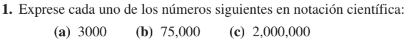

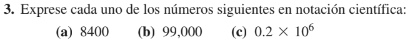

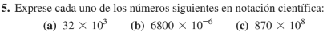

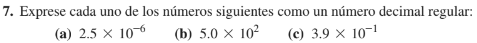

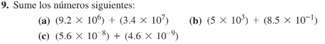

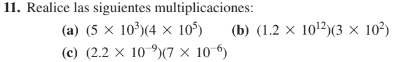

**SECCIÓN 1-3**

**Notación de ingeniería y prefijos métricos**

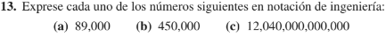

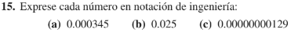

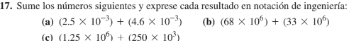

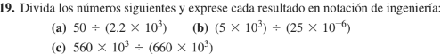

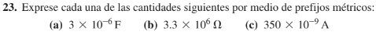

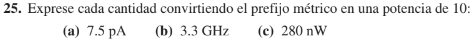

**SECCÍON 1-4**

**Conversiones de unidades métricas**

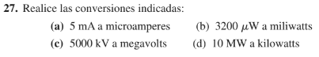

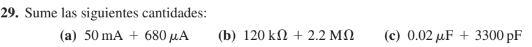

**CAPÍTULO 2**

**SECCIÓN 2-2**

**Carga eléctrica**

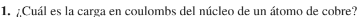

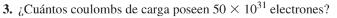

**SECCIÓN 2-3**

**Voltaje, corriente y resisitencia**

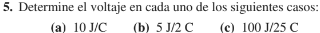

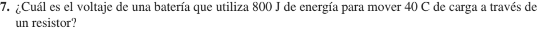

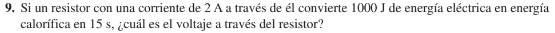

**SECCIÓN 2-4**

**Fuentes de voltaje y de corriente**

**SECCIÓN 2-5**

**Resistores**

**SECCIÓN 2-6**

**El circuito eléctrico**

**SECCIÓN 2-7**

**Mediciones de circuito básicas**

250V

--------------------------------------------------------------------------------------------------------------------------------------------------------------------------------------
**4. VIDEO**

---------------------------------------------------------------------------------------------------------------------------------------------------------------------------------------
**6. CONCLUSIONES**

* Los prefijos métricos al igual que la notacion científica y notación de ingeniería nos sirve para representa números muy grandes y muy pequeños,la notación de ingeniería se usa representar valores de voltaje corriente, potencia,etc, y van acompañados por los prefijos métricos, mientras que la notación científica solo se usa para la represesentacion de valores muy altos o muy pequeño.
* El trabajar con corriente electrica sino se toman las debidas preecauciones de seguridad puede traer consecuencias fatales como la muerte.
* Se obtuvieron varias formulas necesarias para poder clacular voltaje,intesidad, resistecia, conductancia, carga , etc.
* Es necesario e importante saber leer la resistencia (saber la resistencia que puede soportar un resistor). 
* Es importante poner las unidades de medición a lado del resutado obtenido, para evitar confusiones, por lo general se usa el SI (Sistema Internacional).
----------------------------------------------------------------------------------------------------------------------------------------------------------------------------------------

**7. BIBLIOGRAFÍA**

